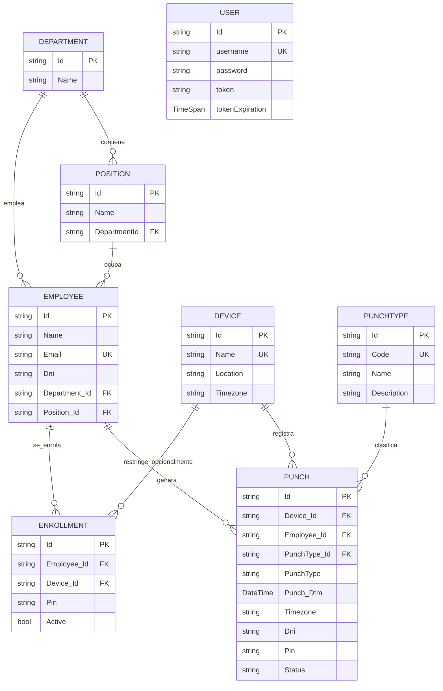
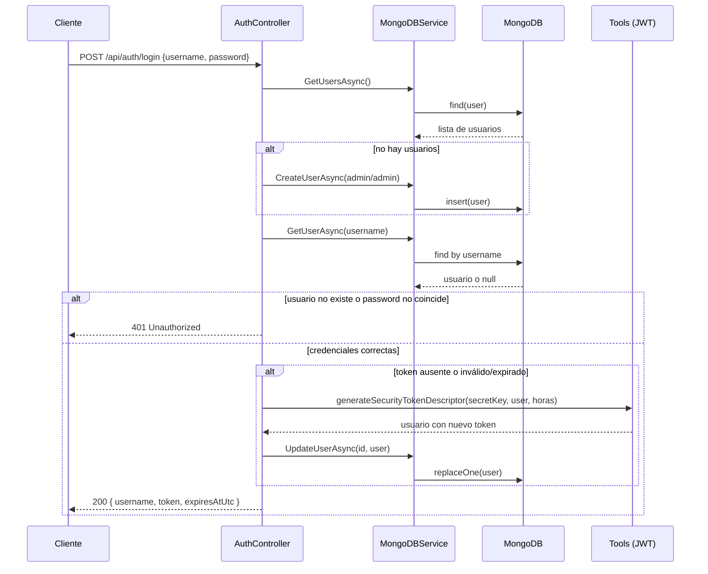
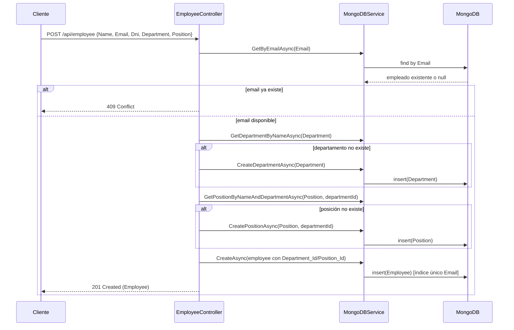
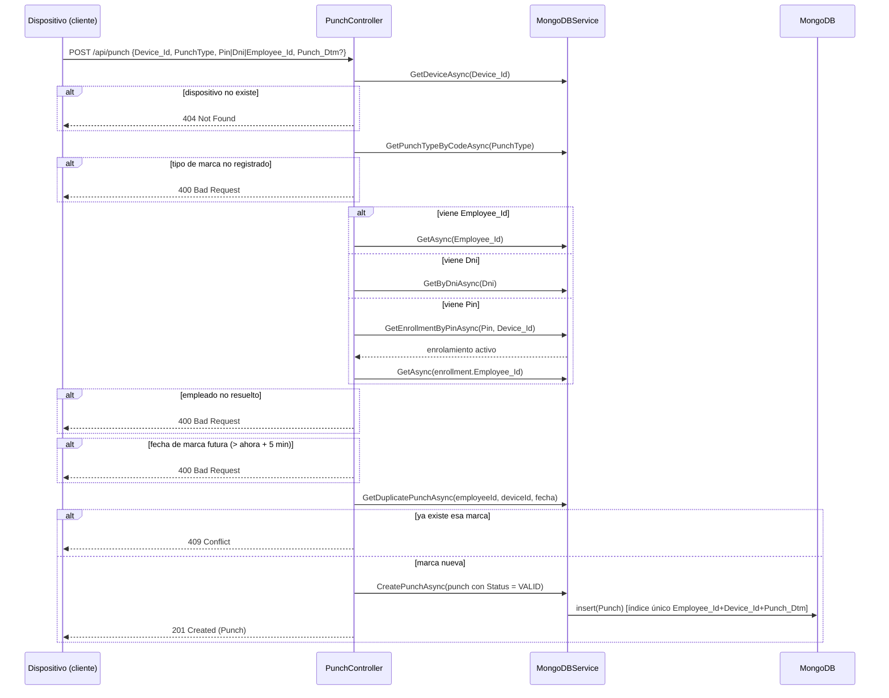

# Análisis técnico — EmployeeAPI

## 1. Resumen de la arquitectura actual

La API sigue una arquitectura en 3 capas simple, sin separación explícita de repositorios ni capa de dominio:

```
Cliente (HTTP)
     │
     ▼
Controllers (Auth, Employee, Device, Enrollment, Punch, Health)
     │
     ▼
MongoDBService  (única clase con todo el acceso a datos)
     │
     ▼
MongoDB (driver oficial MongoDB.Driver, sin ORM)
```

Particularidades relevantes:

- **No usa el pipeline estándar de autenticación de ASP.NET Core** (`AddAuthentication`/`AddJwtBearer`). En su lugar, un middleware propio (`AuthenticationMiddleware`) intercepta cada request, valida el JWT manualmente y también setea los headers CORS a mano.
- **No hay capa de repositorios por entidad**: `MongoDBService` concentra el acceso a las 7 colecciones de Mongo (`employee`, `user`, `Departments`, `Positions`, `Devices`, `PunchTypes`, `Punches`, `Enrollments`).
- **Sin inyección de interfaces**: los controladores dependen directamente de la clase concreta `MongoDBService`, no de una abstracción — dificulta el testing unitario de los controladores (por eso los tests actuales prueban modelos y utilidades, no controladores).

## 2. Componentes principales y responsabilidades

| Componente | Responsabilidad |
|---|---|
| `Program.cs` | Arranque de la app: registra servicios, configura Swagger, ejecuta la inicialización de índices/seed de Mongo al arrancar, y registra el middleware de autenticación antes de `MapControllers()`. |
| `AuthenticationMiddleware` | Intercepta **todas** las requests. Deja pasar sin token: `OPTIONS`, `GET /health`, `POST /api/auth/login` y `/swagger/*`. Para el resto, valida el JWT del header `Authorization`; si falta o es inválido, corta con `401`. También setea los headers CORS en cada respuesta. |
| `AuthController` | Login. Si no hay usuarios, siembra `admin/admin` con la contraseña ya hasheada. Verifica la contraseña con `PasswordHasher.Verify()` (ver sección 8). Reutiliza el token si sigue vigente; si no, genera uno nuevo vía `Tools`. |
| `EmployeeController` | CRUD de empleados + consulta de departamentos/posiciones. Al crear un empleado, resuelve o crea implícitamente el departamento y la posición. |
| `DeviceController` | CRUD de dispositivos de marcación (reloj/terminal). |
| `EnrollmentController` | Asocia un PIN a un empleado (opcionalmente restringido a un dispositivo). Valida que el empleado y el dispositivo existan, y que el PIN no esté ya en uso en ese alcance. |
| `PunchController` | Registra y consulta marcaciones. Resuelve la identidad del empleado por `Employee_Id`, `Dni` o `Pin`, valida el tipo de marca y evita duplicados. |
| `HealthController` | Hace un `ping` a Mongo y responde `200`/`503` según conectividad. |
| `MongoDBService` | Toda la lógica de acceso a datos: CRUD de las 7 colecciones, creación de índices únicos (`Email`, combinación `Employee_Id+Device_Id+Punch_Dtm`, `Code` de tipos de marca), y el seed inicial de tipos de marca (`IN`, `OUT`, `BREAK_IN`, `BREAK_OUT`). |
| `Tools` | Utilidades estáticas para generar y validar JWT (firma HMAC-SHA256), y leer la fecha de expiración del token. |
| `PasswordHasher` | Utilidad estática para hashear y verificar contraseñas con PBKDF2 (agregada como parte de la mejora de la sección 8; reemplaza la comparación en texto plano). |
| Modelos (`Models/`) | DTOs/entidades de Mongo con anotaciones de validación (`[Required]`, `[StringLength]`, `[RegularExpression]`) y de serialización BSON (`[BsonId]`, `[BsonRepresentation]`). |

## 3. Modelo de datos

| Entidad | Colección Mongo | Campos clave |
|---|---|---|
| `Employee` | `employee` | `Id`, `Name`, `Email` (único), `Dni`, `Department_Id`, `Department`, `Position_Id`, `Position` |
| `Department` | `Departments` | `Id`, `Name` |
| `Position` | `Positions` | `Id`, `Name`, `DepartmentId` |
| `User` | `user` | `Id`, `username` (único en la práctica), `password` (hash PBKDF2, ver sección 8), `token`, `tokenExpiration` |
| `Device` | `Devices` | `Id`, `Name` (único), `Location`, `Timezone` (IANA) |
| `Enrollment` | `Enrollments` | `Id`, `Employee_Id`, `Device_Id` (opcional = alcance global), `Pin`, `Active` |
| `PunchType` | `PunchTypes` | `Id`, `Code` (único), `Name`, `Description` |
| `Punch` | `Punches` | `Id`, `Device_Id`, `Employee_Id`, `PunchType_Id`, `PunchType`, `Punch_Dtm`, `Timezone`, `Dni`, `Pin`, `Status` |

**Nota de diseño:** `User` (credenciales de acceso a la API) es una entidad totalmente independiente de `Employee` (la persona registrada en RR.HH.). No hay ninguna relación entre ambas — el sistema de login es genérico ("quién puede usar la API"), no representa la identidad de un empleado específico dentro de la API.

### 3.1 Diagrama entidad-relación



## 4. Flujo de login y uso del token

1. El cliente llama a `POST /api/auth/login` con usuario y contraseña (sin token, esta ruta está exceptuada del middleware).
2. Si no existe ningún usuario en la base, se crea `admin/admin` automáticamente.
3. Se busca el usuario por `username` y se verifica la contraseña con `PasswordHasher.Verify()` contra el hash almacenado (ver sección 8 — antes de la mejora implementada en este challenge, esta comparación era en texto plano).
4. Si el token guardado del usuario sigue vigente, se reutiliza. Si no, se genera uno nuevo firmado con `Jwt:SecretKey` (HMAC-SHA256) y se guarda en el documento del usuario.
5. El cliente debe enviar `Authorization: Bearer <token>` en cada request siguiente. El middleware valida la firma y la expiración en cada llamada (excepto en las rutas exceptuadas).

### 4.1 Diagrama de secuencia — Login



## 5. Flujo de creación y actualización de un empleado

**Creación (`POST /api/employee`):** valida que no exista otro empleado con el mismo email; si el departamento indicado no existe, lo crea; si la posición no existe dentro de ese departamento, la crea; recién entonces inserta el empleado con `Department_Id`/`Position_Id` resueltos.

**Actualización (`PUT /api/employee/{id}`):** reemplaza el documento completo, conservando el `Id` original.

**Actualización parcial (`PATCH /api/employee/{id}`):** actualiza explícitamente solo los campos enviados en `PatchEmployee` (`Name`, `Email`, `Department`). Si se envía `Department` y es distinto al actual, se resuelve (busca-o-crea, igual que en `POST`) y se actualizan `Department` y `Department_Id` **juntos**, evitando la inconsistencia que existía antes de la mejora de la sección 8.4. `Position`/`Position_Id` no se pueden modificar por este medio (no forman parte de `PatchEmployee`), así que no hay riesgo de inconsistencia ahí a través del `PATCH`.

### 5.1 Diagrama de secuencia — Creación de empleado



## 6. Flujo de registro de una marcación

`POST /api/punch` es el endpoint más complejo del sistema: valida el dispositivo, el tipo de marca, resuelve la identidad del empleado, evita fechas futuras y evita duplicados.

**Resolución de identidad (en este orden de prioridad):**
1. `Employee_Id` explícito → búsqueda directa por Id.
2. `Dni` → búsqueda por número de documento.
3. `Pin` → se busca el enrolamiento activo de ese PIN (específico del dispositivo o global) y se obtiene el `Employee_Id` asociado.

Si ninguno de los tres resuelve un empleado, se rechaza con `400`.

### 6.1 Diagrama de secuencia — Registro de marcación



## 7. Riesgos técnicos y de seguridad identificados

Ordenados de mayor a menor impacto:

1. ~~Contraseñas en texto plano~~ **[Corregido, ver sección 8.1]** — Impacto alto (antes de la mejora). Cualquier acceso de lectura a la base (o un backup filtrado) exponía las credenciales de todos los usuarios directamente.
2. **CORS totalmente abierto** (`Access-Control-Allow-Origin` refleja cualquier `Origin` con `credentials: true`) — Impacto medio-alto. Facilita ataques CSRF/robo de sesión desde cualquier sitio.
3. ~~`PATCH` de empleados inconsistente~~ **[Corregido, ver sección 8.4]** con `Department_Id` (antes de la mejora). Impacto medio: generaba datos inconsistentes silenciosamente.
4. **Excepción no controlada en índice único de email** (condición de carrera → `500` en vez de `409`) — Impacto bajo-medio. Solo se manifiesta con requests concurrentes casi simultáneas.
5. **Sin paginación** en listados — Impacto bajo a corto plazo, alto a largo plazo (rendimiento y uso de memoria con datasets grandes).
6. ~~`User.tokenExpiration` mal calculado~~ **[Corregido, ver sección 8.2]** — guardaba solo el `TimeOfDay` de la expiración (perdía la fecha), por lo que ese campo específico no servía como expiración real (antes de la mejora). Impacto bajo porque la validación real del token nunca dependió de este campo (se valida contra el propio JWT), pero era un dato incorrecto persistido en la base.
7. **Secretos de desarrollo en `appsettings.json`** — el JWT secret está en el repositorio (aunque marcado como "dev-only"). Impacto bajo si se respeta la convención, pero riesgoso si alguien lo reutiliza en otro ambiente por descuido.
8. ~~Sin validaciones de formato en `Employee`/`PatchEmployee`~~ **[Corregido, ver sección 8.3]** — `Name`, `Email` y `Dni` no tenían ninguna restricción de formato ni longitud (antes de la mejora); se podían guardar emails inválidos, nombres vacíos o DNIs con cualquier formato. Impacto medio: no es una vulnerabilidad explotable directamente, pero degrada la calidad de los datos y facilita errores aguas abajo (por ejemplo, notificaciones a un email mal formado).
9. ~~`Timezone` del dispositivo se guardaba pero nunca se usaba~~ **[Corregido, ver sección 8.5]** — `Punch.Timezone` se persistía junto a cada marca, pero la API nunca calculaba ni exponía una hora local a partir de él (antes de la mejora); el cliente tenía que hacer la conversión a mano. Impacto bajo: no es un riesgo de seguridad, es una carencia funcional/de usabilidad.

## 8. Mejoras implementadas

### 8.1 Hash de contraseñas con salt (PBKDF2)

**Problema**

Las contraseñas de usuario (incluida la del `admin` sembrado automáticamente) se almacenaban y comparaban en texto plano en `AuthController.cs`. Cualquier acceso de lectura a la base de datos, o un backup filtrado, exponía las credenciales de todos los usuarios directamente. Es el riesgo #1 identificado en la sección 7.

#### Decisión técnica tomada

Se implementó hashing de contraseñas usando **PBKDF2** (`Rfc2898DeriveBytes`), con salt aleatorio de 128 bits por usuario y 100.000 iteraciones (recomendación vigente de OWASP para PBKDF2-SHA256). Se eligió PBKDF2 en lugar de BCrypt o Argon2 porque viene incluido en `System.Security.Cryptography` del propio .NET, sin necesidad de agregar ninguna dependencia NuGet nueva — algo relevante dado el alcance acotado de esta mejora.

El campo `password` de `User` no cambió de nombre ni de tipo (sigue siendo un `string`), pero ahora almacena `"{iteraciones}.{saltBase64}.{hashBase64}"` en lugar del texto plano. Guardar las iteraciones junto con el hash permite subir ese número en el futuro sin invalidar los hashes ya generados.

La comparación en `Verify` usa `CryptographicOperations.FixedTimeEquals` (tiempo constante) en vez de `==`, para no filtrar información por timing attacks.

#### Archivos modificados

| Archivo | Tipo de cambio |
|---|---|
| `Models/PasswordHasher.cs` | Nuevo — contiene `Hash()` y `Verify()`. |
| `Models/User.cs` | Modificado — se documentó que `password` ahora almacena un hash, no texto plano. |
| `Controllers/AuthController.cs` | Modificado — el seed del usuario `admin` ahora usa `PasswordHasher.Hash()`, y el login usa `PasswordHasher.Verify()` en vez de `==`. |
| `Tests/PasswordHasherTests.cs` | Nuevo — 5 pruebas del hasher (ver evidencia abajo). |

#### Riesgos y efectos secundarios considerados

- **Usuarios existentes con contraseña antigua en texto plano quedan bloqueados.** Como el seed automático de `admin` solo se ejecuta si la colección `user` está vacía, una base ya poblada antes de este cambio no se migra sola. `PasswordHasher.Verify` devuelve `false` (no lanza excepción) ante un valor con formato inesperado, así que el efecto es un `401` normal, no un error 500 — pero el usuario no puede loguearse hasta que se le regenere el hash. **Quedó fuera de alcance** un script de migración automática; para esta entrega, la solución fue limpiar el volumen de Mongo (`docker compose down -v`) antes de probar.
- **Sin cambio de contrato público:** `POST /api/auth/login` sigue recibiendo y devolviendo exactamente lo mismo (`username`/`password` en el body, `{username, token, expiresAtUtc}` en la respuesta). Ningún consumidor de la API se ve afectado.
- **Costo de CPU por login:** 100.000 iteraciones de PBKDF2 añaden unos pocos milisegundos por intento de login. Es el costo esperado y deseado de un hash lento (dificulta ataques de fuerza bruta); no es perceptible para un usuario real.

#### Evidencia de validación

1. **Tests automatizados:** `dotnet test Tests/EmployeeAPI.Tests.csproj` → `Superado: 17, Con error: 0` (los 12 tests originales + 5 nuevos de `PasswordHasherTests`, que cubren: verificación correcta, contraseña incorrecta, salts distintos entre hashes de la misma contraseña, que el hash nunca contiene la contraseña en texto plano, y que un valor con formato legado/inválido no rompe la verificación).
2. **Prueba manual end-to-end:** tras `docker compose down -v && docker compose up --build` (base limpia), `POST /api/auth/login` con `{"username":"admin","password":"admin"}` respondió `200` con un JWT válido — el comportamiento externo es idéntico al de antes del cambio.
3. **Inspección directa en Mongo Express:** el documento del usuario `admin` en la colección `user` muestra el campo `password` como `100000.HSLK5YYNkLDggBtVidpN8g==.TS826cTqPl/ehTow8...` en lugar de `"admin"` — confirma que el texto plano ya no se persiste.

### 8.2 Corrección del campo `tokenExpiration` (perdía la fecha)

**Problema**

`User.tokenExpiration` se declaraba como `TimeSpan`, y `Tools.generateSecurityTokenDescriptor` lo llenaba con `tokenDescriptor.Expires.Value.TimeOfDay` — es decir, solo la hora del día (`HH:mm:ss`) en que expira el token, descartando por completo la fecha. Es el riesgo #6 identificado en la sección 7 (la pista explícita del challenge). Un valor como "14:30:00" no permite saber si el token expiró hoy, ayer, o dentro de un año.

#### Decisión técnica tomada

Se cambió el tipo de `User.tokenExpiration` de `TimeSpan` a `DateTime`, y en `Tools.cs` ahora se asigna `tokenDescriptor.Expires.Value` completo (fecha y hora UTC), en vez de solo `.TimeOfDay`. No se renombró el campo ni se tocó su lugar en el modelo, para mantener el cambio acotado: la corrección es de **tipo y valor**, no de diseño.

Se verificó primero que ningún otro archivo del proyecto (controladores, servicios, tests existentes) leyera este campo — solo se escribía en `Tools.cs` y se declaraba en `User.cs`. Esto confirma que era un dato persistido pero nunca consumido: la validación real de expiración del token siempre se hizo contra el propio JWT (`Tools.IsTokenValid`, `Tools.GetExpirationUtc`), no contra este campo.

#### Archivos modificados

| Archivo | Tipo de cambio |
|---|---|
| `Models/User.cs` | Modificado — `tokenExpiration` cambia de `TimeSpan` a `DateTime`. |
| `Models/Tools.cs` | Modificado — se asigna la fecha y hora completas de expiración, no solo `TimeOfDay`. |
| `Tests/TokenTests.cs` | Se agregaron 2 pruebas nuevas (ver evidencia abajo). |

#### Riesgos y efectos secundarios considerados

- **Documentos existentes en Mongo con el valor viejo (`TimeSpan`) podrían fallar al deserializarse** como `DateTime` la próxima vez que se lea ese usuario (por ejemplo, en el login). Es el mismo tipo de riesgo que ya vimos con la migración de contraseñas: una base poblada *antes* de este cambio no es 100% compatible con el nuevo tipo de dato. **Mitigación aplicada para esta entrega:** se validó con una base limpia (`docker compose down -v`), igual que con la mejora anterior. En un entorno real, correspondería un script de migración o una estrategia de deserialización tolerante a valores antiguos.
- **Sin cambio de contrato público:** este campo nunca se expuso en ninguna respuesta de la API (`LoginResponse` solo expone `username`, `token`, `expiresAtUtc`), así que ningún cliente externo se ve afectado.
- **Impacto funcional nulo, impacto de corrección de datos alto:** como el campo no se usaba para ninguna decisión de negocio, este fix no cambia el comportamiento observable de la API — solo corrige un dato persistido que antes era incorrecto por diseño.

#### Evidencia de validación

1. **Tests automatizados:** se agregaron 2 pruebas a `TokenTests.cs`: una confirma que `tokenExpiration` cae en el rango de fecha/hora real esperado (no en un rango de 24 horas sin fecha), y otra confirma que coincide (con menos de 1 segundo de diferencia) con la expiración real leída desde el propio JWT vía `Tools.GetExpirationUtc`.
2. **Suite completa:** `dotnet test Tests/EmployeeAPI.Tests.csproj` → todas las pruebas (las 17 anteriores + las 2 nuevas, 19 en total) en verde.
3. **Prueba manual end-to-end:** tras `docker compose down -v && docker compose up --build` (base limpia), `POST /api/auth/login` respondió `200` con `"expiresAtUtc": "2026-09-10T11:45:49Z"`. Al inspeccionar el mismo usuario en Mongo Express, el campo `tokenExpiration` mostró `Thu Sep 10 2026 11:45:49 GMT+0000` — una fecha completa (día, mes, año y hora) que coincide exactamente con la expiración real del JWT, en vez de un valor de solo horas sin fecha como antes del fix.

### 8.3 Validaciones de entrada en `Employee`/`PatchEmployee`

**Problema**

Ni `Employee` ni `PatchEmployee` tenían ninguna anotación de validación: `Name`, `Email` y `Department` eran `string` no-nulos sin ninguna restricción real (de hecho, generaban las advertencias del compilador `CS8618` vistas en cada `dotnet test`, porque nunca se les daba un valor por defecto), y `Dni` aceptaba cualquier texto. Es el riesgo #8 identificado en la sección 7, y coincide con una de las mejoras sugeridas explícitamente por el challenge.

#### Decisión técnica tomada

Se agregaron `DataAnnotations` siguiendo exactamente el mismo estilo que ya usa el proyecto en `Device.cs`, `Enrollment.cs` y `PunchType.cs` (`[Required]`, `[StringLength]`, `[RegularExpression]` con `ErrorMessage` en español) — no se inventó un estilo nuevo, se replicó el existente:

- `Name`, `Department`, `Position`: `[Required]` + `[StringLength(100, MinimumLength = 2)]`.
- `Email`: `[Required]` + `[EmailAddress]` + `[StringLength(150)]`.
- `Dni`: **se mantuvo opcional** (sin `[Required]`), pero se le agregó `[RegularExpression(@"^\d{7,8}-[\dkK]$")]` para validar el formato cuando sí se envía. No se hizo obligatorio porque el diseño original ya permite identificar a un empleado por `Id` o `Pin` al marcar, sin depender del DNI (ver sección 6) — exigirlo habría sido un cambio de comportamiento no solicitado, no solo una validación.
- En `PatchEmployee`, los mismos formatos se validan (`StringLength`, `EmailAddress`) pero **ningún campo es `[Required]`**, porque un `PATCH` parcial legítimamente puede no enviar todos los campos.

Como efecto colateral positivo, agregar `= null!;` a las propiedades no-nulas (siguiendo el mismo patrón que `Device.cs`) eliminó las advertencias `CS8618` de `Employee.cs` que aparecían en cada build.

#### Archivos modificados

| Archivo | Tipo de cambio |
|---|---|
| `Models/Employee.cs` | Modificado — se agregaron `DataAnnotations` a `Name`, `Email`, `Dni`, `Department`, `Position`. |
| `Models/PatchEmployee.cs` | Modificado — se agregaron `DataAnnotations` a `Name`, `Email`, `Department` (todos opcionales). |
| `Tests/ModelValidationTests.cs` | Se agregaron pruebas para `Employee` y `PatchEmployee` (ver evidencia abajo). |

#### Riesgos y efectos secundarios considerados

- **Empleados ya guardados en Mongo con datos que no pasarían estas validaciones** (por ejemplo, un email mal formado creado antes de este cambio) no se ven afectados retroactivamente: las validaciones solo se aplican en el momento de recibir un request nuevo (`POST`/`PUT`/`PATCH`), no al leer datos existentes. No hay riesgo de que la API deje de funcionar con datos viejos, a diferencia de las dos mejoras anteriores.
- **`PUT /api/employee/{id}` ahora exige el mismo formato que `POST`** (porque reutiliza el modelo `Employee` completo), lo que significa que actualizar un empleado con un email inválido que antes se aceptaba, ahora será rechazado con `400`. Es un cambio de comportamiento intencional y deseado, pero vale la pena que quede explícito.
- **No se validó `Department`/`Position` contra la lista real de departamentos/posiciones existentes** — solo se valida formato (longitud mínima/máxima), no que el valor "tenga sentido" en el negocio. Eso sigue siendo responsabilidad de la lógica de `EmployeeController` (buscar-o-crear), que no se tocó.

#### Evidencia de validación

1. **Tests automatizados:** se agregaron 8 métodos de prueba a `ModelValidationTests.cs` (algunos con múltiples casos vía `[Theory]`), cubriendo: campos requeridos válidos, `Name` vacío, 3 formatos de email inválidos, 3 formatos de DNI inválidos, 3 formatos de DNI válidos (incluyendo el dígito verificador `K` en mayúscula y minúscula), DNI ausente (debe seguir siendo válido, por ser opcional), y que `PatchEmployee` sin ningún campo enviado sigue siendo válido (por ser una actualización parcial).
2. **Suite completa:** `dotnet test Tests/EmployeeAPI.Tests.csproj` → todas las pruebas en verde (19 anteriores + las nuevas de esta mejora).

### 8.4 Consistencia de `Department_Id` en el `PATCH` de empleados

**Problema**

`PATCH /api/employee/{id}` actualizaba los campos enviados **por reflexión genérica**: tomaba cada propiedad no nula de `PatchEmployee` y la copiaba directo al `Employee` guardado, sin ninguna lógica adicional. Si el body incluía `{"department": "Tecnologia"}`, el campo `Department` cambiaba, pero `Department_Id` seguía apuntando al departamento anterior — el empleado quedaba con un nombre de departamento y un ID de departamento que no correspondían entre sí. Es el riesgo #3 identificado en la sección 7.

(La parte del riesgo original que hablaba de `Position_Id` no aplicaba en la práctica: `PatchEmployee` nunca expuso `Position` como campo editable, así que no existía una ruta real para inconsistencia ahí.)

#### Decisión técnica tomada

Se reemplazó el bucle de reflexión por actualizaciones explícitas campo por campo. Para `Name` y `Email`, el cambio es directo. Para `Department`, se replicó el mismo patrón "buscar o crear" que ya usa `POST /api/employee` (`GetDepartmentByNameAsync` → si no existe, `CreateDepartmentAsync`), y se actualizan `Department` y `Department_Id` **en la misma operación**, nunca uno sin el otro. Se agregó además una comparación previa (`employee.Department != employeeFromDb.Department`) para no golpear la base innecesariamente si el valor enviado es igual al que ya tenía el empleado.

Se descartó reescribir todo el endpoint para aceptar también `Position` en el `PATCH` (que solucionaría el caso de `Position_Id` de raíz): habría sido un cambio de alcance de la API, no una corrección de un bug, y se sale de lo que esta mejora busca resolver.

#### Archivos modificados

| Archivo | Tipo de cambio |
|---|---|
| `Controllers/EmployeeController.cs` | Modificado — el método `UpdateEmployee` (`PATCH`) ya no usa reflexión; actualiza cada campo explícitamente y resuelve `Department_Id` igual que `POST`. |

#### Riesgos y efectos secundarios considerados

- **Sin pruebas automatizadas para esta mejora puntual.** A diferencia de las mejoras 8.1 y 8.2 (funciones puras, testeables sin infraestructura), este fix depende de `MongoDBService` real (buscar/crear un departamento). El proyecto no usa ninguna librería de mocking, y agregar una solo para esta prueba habría significado sumar una dependencia nueva no estrictamente necesaria. Se optó por **validación manual end-to-end** en su lugar (ver evidencia abajo), siendo transparentes sobre esta limitación en vez de forzar una cobertura automatizada artificial.
- **Si el nuevo nombre de departamento no existía, se crea uno nuevo** (igual que en `POST`) — esto es el comportamiento esperado y documentado, pero vale la pena tenerlo presente: un typo en el `PATCH` (ej. "Operaiones" en vez de "Operaciones") crea silenciosamente un departamento nuevo en vez de fallar. Este comportamiento ya existía en `POST` desde antes; no es nuevo de esta mejora, solo se replicó por consistencia.
- **`Position`/`Position_Id` no se re-validan cuando cambia `Department`** — si un empleado en "Operaciones / Analista" cambia de departamento a "Tecnologia" vía `PATCH`, se queda con `Position: "Analista"` y su `Position_Id` original, aunque "Analista" nunca se haya creado dentro de "Tecnologia". Corregir esto de raíz requeriría permitir editar `Position` en el mismo `PATCH` (fuera del alcance elegido para esta mejora) — queda documentado como limitación conocida, no resuelta.

#### Evidencia de validación

Con la API corriendo (`docker compose up`), se probó manualmente vía el archivo `EmployeeAPI.http`:

1. Se creó un empleado en el departamento "Operaciones" (`POST /api/employee`).
2. Se le aplicó `PATCH /api/employee/{id}` con `{"department": "Tecnologia"}`.
3. Se confirmó en Mongo Express que el documento del empleado quedó con `Department: "Tecnologia"` **y** `Department_Id` apuntando al `_id` real del departamento "Tecnologia" (no al de "Operaciones") — comportamiento distinto al que había antes del fix, donde `Department_Id` se hubiera quedado con el valor viejo.

### 8.5 Exponer la hora local de la marca usando el `Timezone` del dispositivo

**Problema**

Cada `Punch` guarda `Punch_Dtm` (la fecha/hora en UTC) y `Timezone` (la zona horaria del dispositivo, ej. `"America/Santiago"`), pero nadie combinaba esos dos datos para calcular una hora local legible. El cliente de la API tenía que hacer esa conversión por su cuenta. Es el riesgo #9 identificado en la sección 7, y coincide con una mejora sugerida explícitamente por el challenge.

#### Decisión técnica tomada

Se agregó `TimeZoneHelper.ToLocalTime(DateTime utc, string? ianaTimeZoneId)`, una función pura que usa `TimeZoneInfo` (incluido en .NET, sin dependencias nuevas) para convertir. Se expuso como una propiedad calculada de solo lectura en `Punch`: `Punch_Dtm_Local`, marcada con `[BsonIgnore]` para que **no se persista** en Mongo — se recalcula cada vez que se serializa la respuesta, a partir de `Punch_Dtm` y `Timezone` que ya existían.

Se decidió que el helper **nunca lanza una excepción**: si `Timezone` es nulo/vacío, o si el sistema operativo no reconoce ese identificador (por ejemplo, si faltara la base de datos de zonas horarias del sistema operativo), devuelve `null` en vez de reventar. Un dato de conveniencia como este no debería poder impedir que una marca se registre o se consulte.

#### Archivos modificados

| Archivo | Tipo de cambio |
|---|---|
| `Models/TimeZoneHelper.cs` | Nuevo — contiene `ToLocalTime()`. |
| `Models/Punch.cs` | Modificado — se agregó la propiedad calculada `Punch_Dtm_Local`. |
| `Tests/TimeZoneHelperTests.cs` | Nuevo — 7 pruebas (ver evidencia abajo). |

#### Riesgos y efectos secundarios considerados

- **Depende de que el sistema operativo del contenedor tenga la base de datos de zonas horarias (`tzdata`) instalada.** La imagen base (`mcr.microsoft.com/dotnet/aspnet:8.0`, Debian) la trae por defecto, pero si algún día cambia la imagen base, esto podría dejar de funcionar. Por diseño, el helper no rompe nada si eso pasara: simplemente `Punch_Dtm_Local` sale `null`.
- **Sin cambio de contrato para consumidores existentes:** `Punch_Dtm` y `Timezone` siguen exactamente igual; `punch_Dtm_Local` es un campo *adicional* en la respuesta JSON, no reemplaza nada. Ningún cliente que ya lea la respuesta se rompe por este cambio.
- **No se aplicó horario de verano de forma manual:** se usa `TimeZoneInfo`, que ya maneja las reglas de horario de verano de cada zona automáticamente (por eso los tests usan Bogotá y Tokio, que no tienen horario de verano, para que el resultado esperado no dependa de en qué fecha se ejecute el test).

#### Evidencia de validación

1. **Tests automatizados:** 7 pruebas en `TimeZoneHelperTests.cs`: conversión correcta con 2 zonas horarias reales sin horario de verano (Bogotá UTC-5, Tokio UTC+9), `Timezone` nulo o vacío devuelve `null`, un identificador de zona inválido devuelve `null` en vez de lanzar excepción, y 2 pruebas de integración contra la propiedad `Punch.Punch_Dtm_Local` directamente.
2. **Suite completa:** `dotnet test Tests/EmployeeAPI.Tests.csproj` → todas las pruebas en verde.

## 9. Decisiones técnicas y pendientes

- Se priorizó PBKDF2 sobre BCrypt/Argon2 por no requerir dependencias externas nuevas, dado el alcance acotado de esta entrega.
- **Se implementó una segunda mejora (sección 8.2) además de la mínima requerida**, ya que el tiempo disponible lo permitió y el challenge valora la calidad sobre la cantidad, no la cantidad mínima estricta. Se priorizó `tokenExpiration` sobre otras candidatas (CORS, PATCH, paginación) porque es la única que el propio challenge señala explícitamente como "buen candidato a corrección", y porque se pudo verificar con confianza que ningún otro código dependía del valor viejo antes de cambiarlo — el mismo nivel de cuidado que la primera mejora, no una adición apurada.
- **Se implementó una tercera mejora (sección 8.3):** validaciones de entrada en `Employee`/`PatchEmployee`, replicando el estilo de `DataAnnotations` que ya usaba el resto del proyecto (`Device`, `Enrollment`, `PunchType`) en vez de introducir un enfoque nuevo. Efecto secundario a tener presente: `PUT /api/employee/{id}` ahora es más estricto que antes (rechaza formatos que antes aceptaba), un cambio de comportamiento intencional documentado en la sección 8.3.
- **Se implementó una cuarta mejora (sección 8.4):** consistencia de `Department_Id` en el `PATCH` de empleados. A diferencia de las 3 mejoras anteriores, esta no tiene pruebas automatizadas propias — depende de `MongoDBService` real y el proyecto no usa mocking, así que se validó manualmente (documentado en la sección 8.4). Se decidió ser explícitos sobre esta diferencia de cobertura en vez de ocultarla.
- **Pendiente:** `Position`/`Position_Id` pueden quedar semánticamente inconsistentes tras un `PATCH` que cambia `Department` (ver riesgos de la sección 8.4) — no se resolvió porque `PatchEmployee` no expone `Position` como campo editable; solucionarlo de raíz implicaría ampliar el contrato del endpoint, fuera del alcance de una corrección acotada.
- **Se implementó una quinta mejora (sección 8.5):** exponer la hora local de la marca (`Punch_Dtm_Local`) a partir de `Timezone`, con una función pura y testeable (`TimeZoneHelper`), sin dependencias nuevas. Se priorizó que nunca lance una excepción (por ejemplo, si el sistema operativo no reconoce la zona horaria), devolviendo `null` en ese caso en vez de romper el registro o la consulta de una marca.
- **Pendiente:** migración de usuarios con contraseñas antiguas en texto plano (actualmente requiere recrear el usuario o la base). En un entorno real se agregaría un script de migración único, o un mecanismo transicional de "rehash en el siguiente login exitoso con texto plano".
- **Pendiente:** documentos de `user` guardados en Mongo *antes* de la corrección de `tokenExpiration` (sección 8.2) quedan con un valor de tipo incompatible (`TimeSpan` en vez de `DateTime`); requieren una base limpia o una migración, igual que el punto anterior.
- **Pendiente:** el resto de riesgos de la sección 7 (CORS abierto, `PATCH` inconsistente, falta de paginación, condición de carrera en email único, timezone en marcaciones) no se abordaron en esta entrega — el challenge permite explícitamente elegir mejoras acotadas en lugar de cubrir todas las recomendaciones.
- **Interfaz web opcional (punto 5):** se implementó en `frontend/` (HTML/CSS/JS vanilla, sin build). Se estructuró en capas siguiendo el principio de dependencia de Clean Architecture — `api-client.js` (infraestructura) y `session.js` (dominio) no importan `view.js` (presentación) ni entre sí; solo `app.js` (orquestación) conoce a las tres. Esto se aplicó únicamente al frontend, código nuevo sin restricciones de la actividad C; el backend existente no se reestructuró a Clean Architecture, ya que eso habría significado una reescritura grande, incoherente con la restricción de "cambios pequeños, trazables y coherentes con la arquitectura actual" del challenge.
