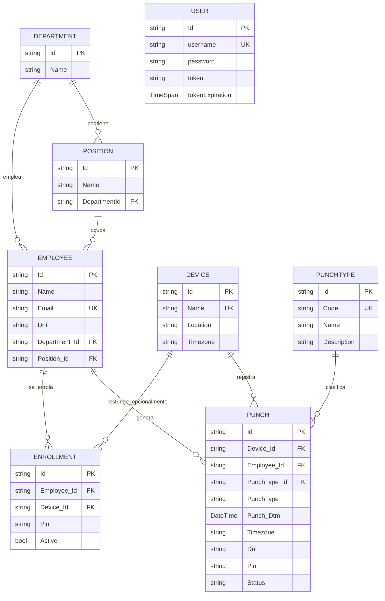
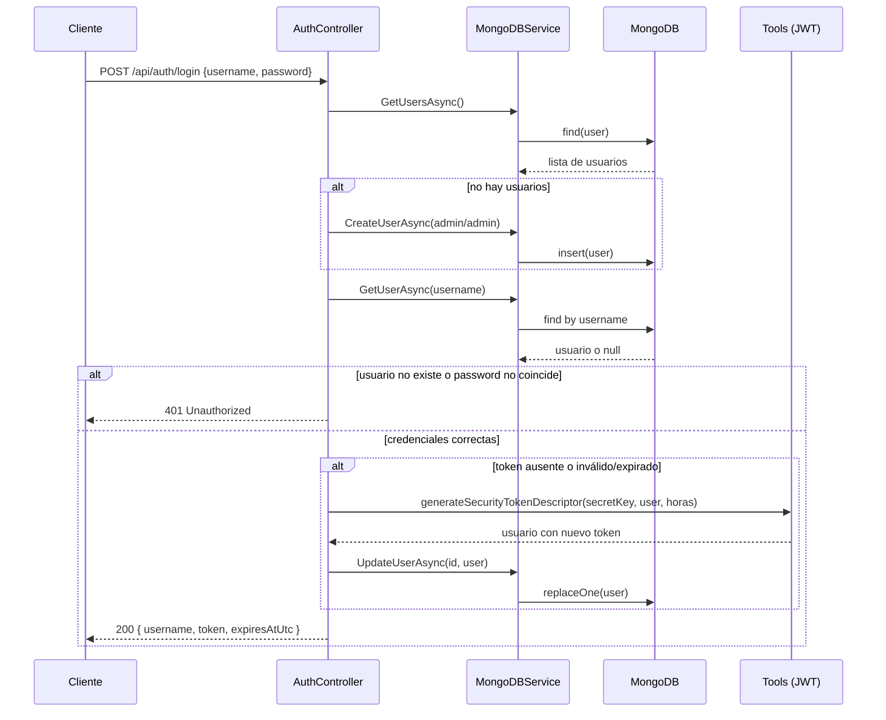
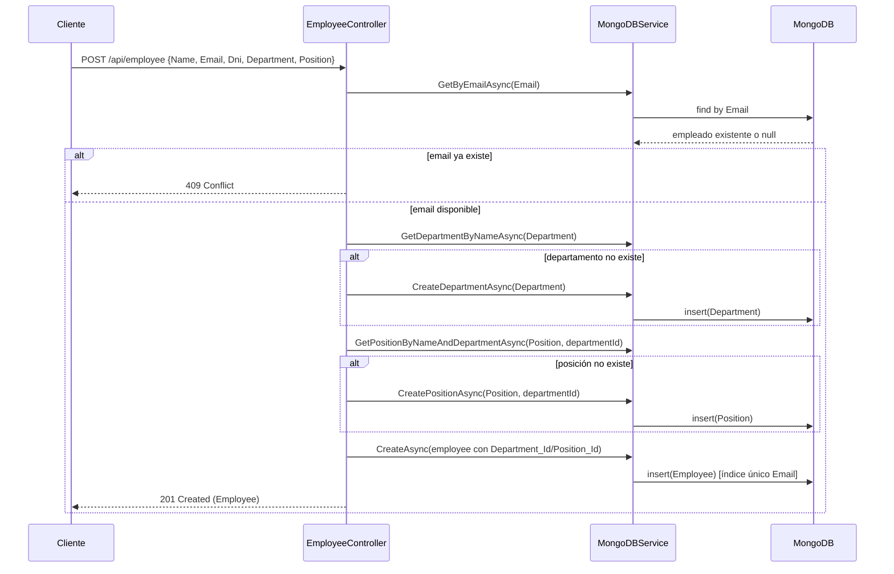
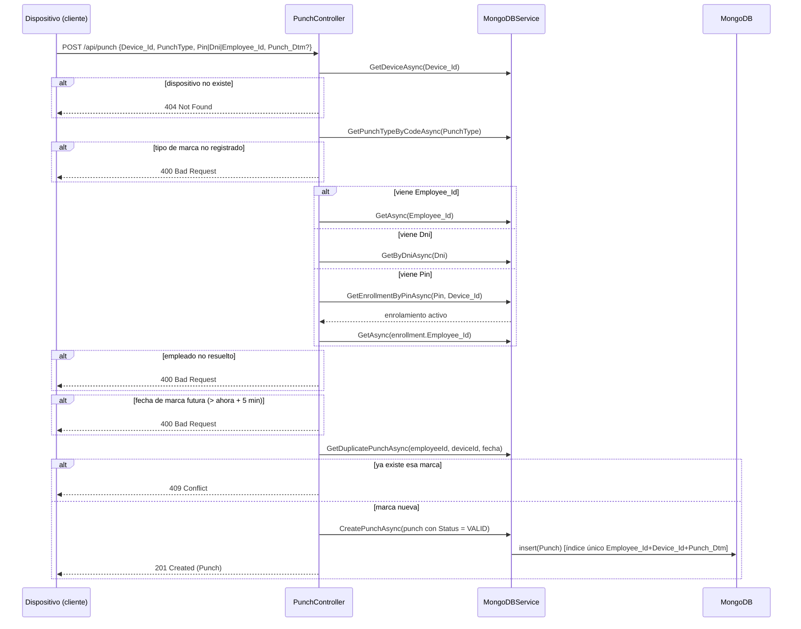

# Análisis técnico — EmployeeAPI

## 1. Resumen de la arquitectura actual

La API sigue una arquitectura en 3 capas simple, sin separación explícita de repositorios ni capa de dominio:

```
Cliente (HTTP)
     │
     ▼
Controllers (Auth, Employee, Device, Enrollment, Punch, Health)
     │
     ▼
MongoDBService  (única clase con todo el acceso a datos)
     │
     ▼
MongoDB (driver oficial MongoDB.Driver, sin ORM)
```

Particularidades relevantes:

- **No usa el pipeline estándar de autenticación de ASP.NET Core** (`AddAuthentication`/`AddJwtBearer`). En su lugar, un middleware propio (`AuthenticationMiddleware`) intercepta cada request, valida el JWT manualmente y también setea los headers CORS a mano.
- **No hay capa de repositorios por entidad**: `MongoDBService` concentra el acceso a las 7 colecciones de Mongo (`employee`, `user`, `Departments`, `Positions`, `Devices`, `PunchTypes`, `Punches`, `Enrollments`).
- **Sin inyección de interfaces**: los controladores dependen directamente de la clase concreta `MongoDBService`, no de una abstracción — dificulta el testing unitario de los controladores (por eso los tests actuales prueban modelos y utilidades, no controladores).

## 2. Componentes principales y responsabilidades

| Componente | Responsabilidad |
|---|---|
| `Program.cs` | Arranque de la app: registra servicios, configura Swagger, ejecuta la inicialización de índices/seed de Mongo al arrancar, y registra el middleware de autenticación antes de `MapControllers()`. |
| `AuthenticationMiddleware` | Intercepta **todas** las requests. Deja pasar sin token: `OPTIONS`, `GET /health`, `POST /api/auth/login` y `/swagger/*`. Para el resto, valida el JWT del header `Authorization`; si falta o es inválido, corta con `401`. También setea los headers CORS en cada respuesta. |
| `AuthController` | Login. Si no hay usuarios, siembra `admin/admin`. Compara contraseña en texto plano. Reutiliza el token si sigue vigente; si no, genera uno nuevo vía `Tools`. |
| `EmployeeController` | CRUD de empleados + consulta de departamentos/posiciones. Al crear un empleado, resuelve o crea implícitamente el departamento y la posición. |
| `DeviceController` | CRUD de dispositivos de marcación (reloj/terminal). |
| `EnrollmentController` | Asocia un PIN a un empleado (opcionalmente restringido a un dispositivo). Valida que el empleado y el dispositivo existan, y que el PIN no esté ya en uso en ese alcance. |
| `PunchController` | Registra y consulta marcaciones. Resuelve la identidad del empleado por `Employee_Id`, `Dni` o `Pin`, valida el tipo de marca y evita duplicados. |
| `HealthController` | Hace un `ping` a Mongo y responde `200`/`503` según conectividad. |
| `MongoDBService` | Toda la lógica de acceso a datos: CRUD de las 7 colecciones, creación de índices únicos (`Email`, combinación `Employee_Id+Device_Id+Punch_Dtm`, `Code` de tipos de marca), y el seed inicial de tipos de marca (`IN`, `OUT`, `BREAK_IN`, `BREAK_OUT`). |
| `Tools` | Utilidades estáticas para generar y validar JWT (firma HMAC-SHA256), y leer la fecha de expiración del token. |
| Modelos (`Models/`) | DTOs/entidades de Mongo con anotaciones de validación (`[Required]`, `[StringLength]`, `[RegularExpression]`) y de serialización BSON (`[BsonId]`, `[BsonRepresentation]`). |

## 3. Modelo de datos

| Entidad | Colección Mongo | Campos clave |
|---|---|---|
| `Employee` | `employee` | `Id`, `Name`, `Email` (único), `Dni`, `Department_Id`, `Department`, `Position_Id`, `Position` |
| `Department` | `Departments` | `Id`, `Name` |
| `Position` | `Positions` | `Id`, `Name`, `DepartmentId` |
| `User` | `user` | `Id`, `username` (único en la práctica), `password` (texto plano), `token`, `tokenExpiration` |
| `Device` | `Devices` | `Id`, `Name` (único), `Location`, `Timezone` (IANA) |
| `Enrollment` | `Enrollments` | `Id`, `Employee_Id`, `Device_Id` (opcional = alcance global), `Pin`, `Active` |
| `PunchType` | `PunchTypes` | `Id`, `Code` (único), `Name`, `Description` |
| `Punch` | `Punches` | `Id`, `Device_Id`, `Employee_Id`, `PunchType_Id`, `PunchType`, `Punch_Dtm`, `Timezone`, `Dni`, `Pin`, `Status` |

**Nota de diseño:** `User` (credenciales de acceso a la API) es una entidad totalmente independiente de `Employee` (la persona registrada en RR.HH.). No hay ninguna relación entre ambas — el sistema de login es genérico ("quién puede usar la API"), no representa la identidad de un empleado específico dentro de la API.

### 3.1 Diagrama entidad-relación



## 4. Flujo de login y uso del token

1. El cliente llama a `POST /api/auth/login` con usuario y contraseña (sin token, esta ruta está exceptuada del middleware).
2. Si no existe ningún usuario en la base, se crea `admin/admin` automáticamente.
3. Se busca el usuario por `username` y se compara la contraseña **en texto plano** (riesgo documentado en el README).
4. Si el token guardado del usuario sigue vigente, se reutiliza. Si no, se genera uno nuevo firmado con `Jwt:SecretKey` (HMAC-SHA256) y se guarda en el documento del usuario.
5. El cliente debe enviar `Authorization: Bearer <token>` en cada request siguiente. El middleware valida la firma y la expiración en cada llamada (excepto en las rutas exceptuadas).

### 4.1 Diagrama de secuencia — Login



## 5. Flujo de creación y actualización de un empleado

**Creación (`POST /api/employee`):** valida que no exista otro empleado con el mismo email; si el departamento indicado no existe, lo crea; si la posición no existe dentro de ese departamento, la crea; recién entonces inserta el empleado con `Department_Id`/`Position_Id` resueltos.

**Actualización (`PUT /api/employee/{id}`):** reemplaza el documento completo, conservando el `Id` original.

**Actualización parcial (`PATCH /api/employee/{id}`):** actualiza por reflexión solo los campos enviados en `PatchEmployee` (`Name`, `Email`, `Department`). **Riesgo:** si se cambia `Department` por este medio, no se recalcula `Department_Id`, quedando inconsistente con el nombre.

### 5.1 Diagrama de secuencia — Creación de empleado



## 6. Flujo de registro de una marcación

`POST /api/punch` es el endpoint más complejo del sistema: valida el dispositivo, el tipo de marca, resuelve la identidad del empleado, evita fechas futuras y evita duplicados.

**Resolución de identidad (en este orden de prioridad):**
1. `Employee_Id` explícito → búsqueda directa por Id.
2. `Dni` → búsqueda por número de documento.
3. `Pin` → se busca el enrolamiento activo de ese PIN (específico del dispositivo o global) y se obtiene el `Employee_Id` asociado.

Si ninguno de los tres resuelve un empleado, se rechaza con `400`.

### 6.1 Diagrama de secuencia — Registro de marcación



## 7. Riesgos técnicos y de seguridad identificados

Ordenados de mayor a menor impacto:

1. **Contraseñas en texto plano** — Impacto alto. Cualquier acceso de lectura a la base (o un backup filtrado) expone las credenciales de todos los usuarios directamente.
2. **CORS totalmente abierto** (`Access-Control-Allow-Origin` refleja cualquier `Origin` con `credentials: true`) — Impacto medio-alto. Facilita ataques CSRF/robo de sesión desde cualquier sitio.
3. **`PATCH` de empleados inconsistente** con `Department_Id`/`Position_Id` — Impacto medio. Genera datos inconsistentes silenciosamente.
4. **Excepción no controlada en índice único de email** (condición de carrera → `500` en vez de `409`) — Impacto bajo-medio. Solo se manifiesta con requests concurrentes casi simultáneas.
5. **Sin paginación** en listados — Impacto bajo a corto plazo, alto a largo plazo (rendimiento y uso de memoria con datasets grandes).
6. **`User.tokenExpiration` mal calculado** — guarda solo el `TimeOfDay` de la expiración (pierde la fecha), por lo que ese campo específico no sirve como expiración real. Impacto bajo porque la validación real del token no depende de este campo (se valida contra el propio JWT), pero es un dato incorrecto persistido en la base.
7. **Secretos de desarrollo en `appsettings.json`** — el JWT secret está en el repositorio (aunque marcado como "dev-only"). Impacto bajo si se respeta la convención, pero riesgoso si alguien lo reutiliza en otro ambiente por descuido.
